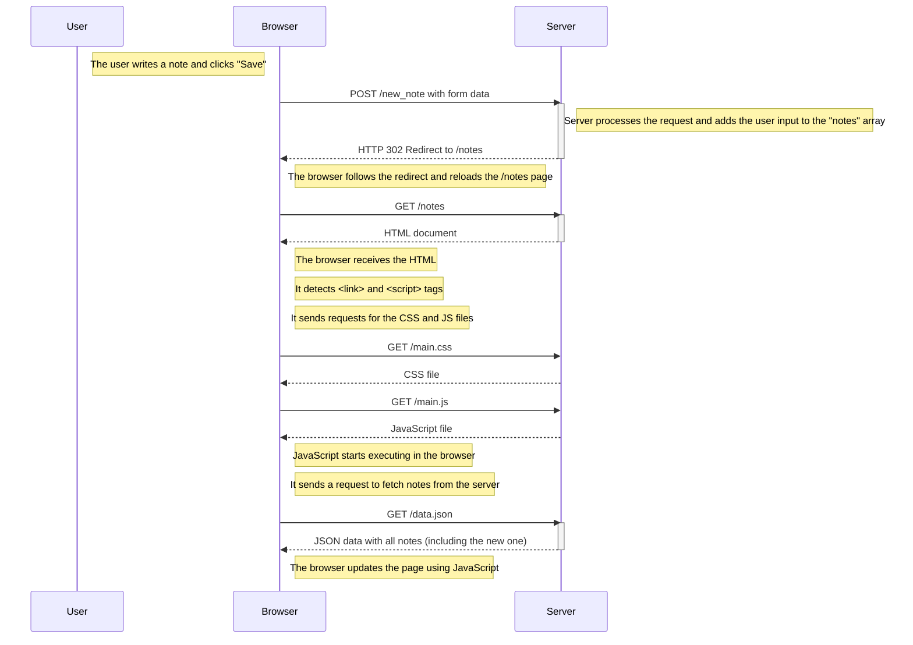

```mermaid
sequenceDiagram
    participant User
    participant Browser
    participant Server

    Note right of User: The user writes a note and clicks "Save"

    Browser->>Server: POST /new_note with form data
    activate Server
    Note right of Server: Server processes the request and adds the user input to the "notes" array
    Server-->>Browser: HTTP 302 Redirect to /notes
    deactivate Server

    Note right of Browser: The browser follows the redirect and reloads the /notes page

    Browser->>Server: GET /notes
    activate Server
    Server-->>Browser: HTML document
    deactivate Server

    Note right of Browser: The browser receives the HTML
    Note right of Browser: It detects <link> and <script> tags
    Note right of Browser: It sends requests for the CSS and JS files

    Browser->>Server: GET /main.css
    Server-->>Browser: CSS file

    Browser->>Server: GET /main.js
    Server-->>Browser: JavaScript file

    Note right of Browser: JavaScript starts executing in the browser
    Note right of Browser: It sends a request to fetch notes from the server

    Browser->>Server: GET /data.json
    activate Server
    Server-->>Browser: JSON data with all notes (including the new one)
    deactivate Server

    Note right of Browser: The browser updates the page using JavaScript
```
