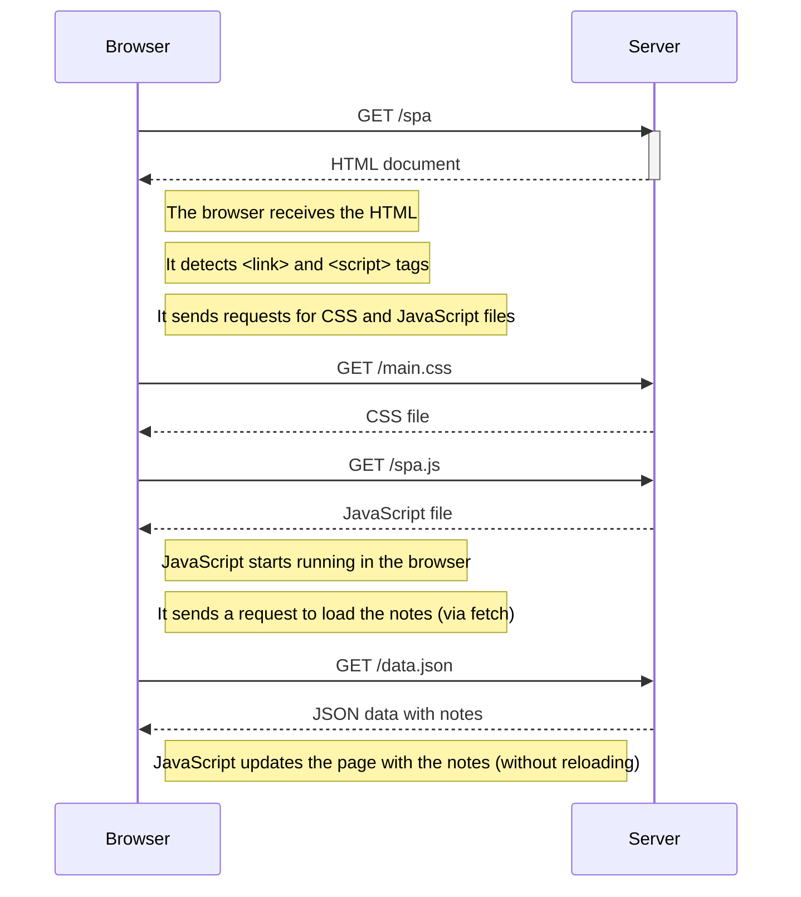

```mermaid
sequenceDiagram
    participant Browser
    participant Server

    Browser->>Server: GET /spa
    activate Server
    Server-->>Browser: HTML document
    deactivate Server

    Note right of Browser: The browser receives the HTML
    Note right of Browser: It detects <link> and <script> tags
    Note right of Browser: It sends requests for CSS and JavaScript files

    Browser->>Server: GET /main.css
    Server-->>Browser: CSS file

    Browser->>Server: GET /spa.js
    Server-->>Browser: JavaScript file

    Note right of Browser: JavaScript starts running in the browser
    Note right of Browser: It sends a request to load the notes (via fetch)

    Browser->>Server: GET /data.json
    Server-->>Browser: JSON data with notes

    Note right of Browser: JavaScript updates the page with the notes (without reloading)
```
