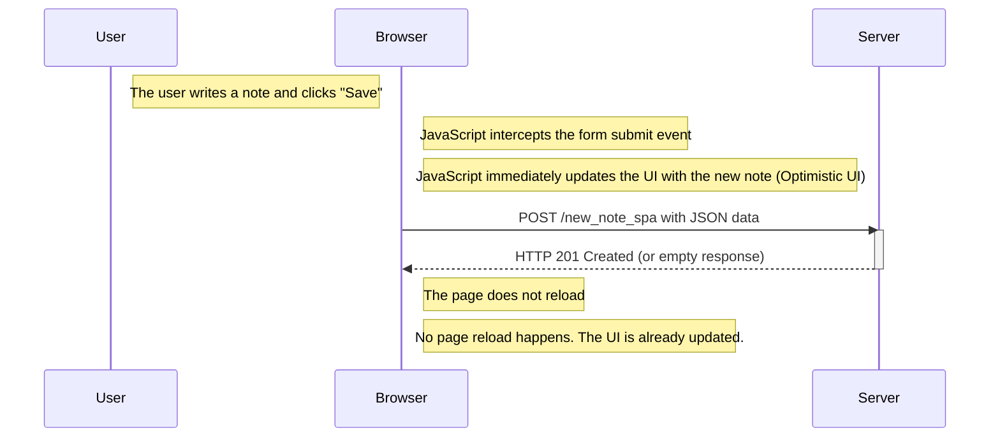

```mermaid
sequenceDiagram
    participant User
    participant Browser
    participant Server

    Note right of User: The user writes a note and clicks "Save"

    Note right of Browser: JavaScript intercepts the form submit event
    Note right of Browser: JavaScript immediately updates the UI with the new note (Optimistic UI)

    Browser->>Server: POST /new_note_spa with JSON data
    activate Server
    Server-->>Browser: HTTP 201 Created (or empty response)
    deactivate Server

    Note right of Browser: The page does not reload
    Note right of Browser: No page reload happens. The UI is already updated.
```
